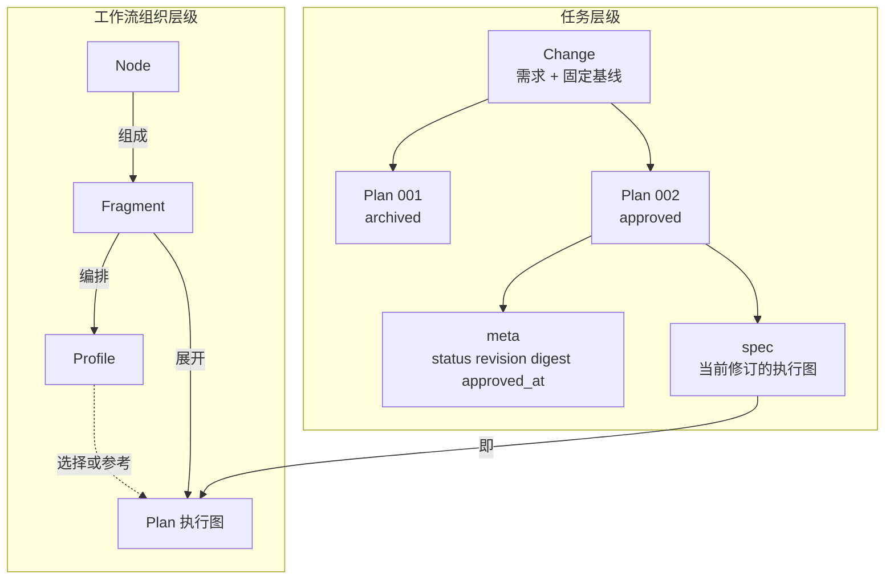
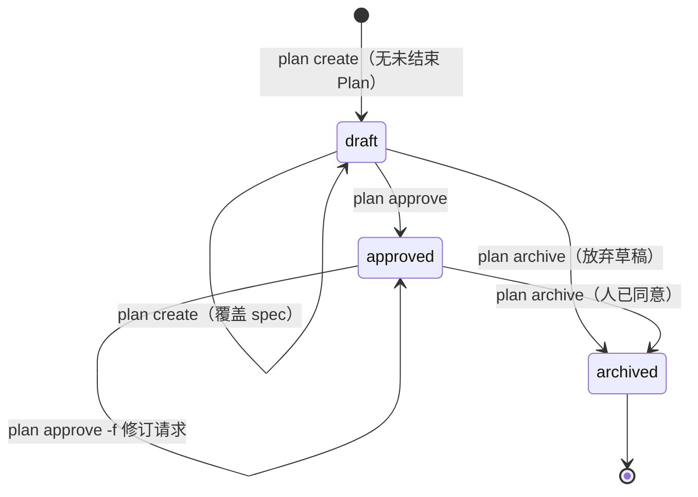
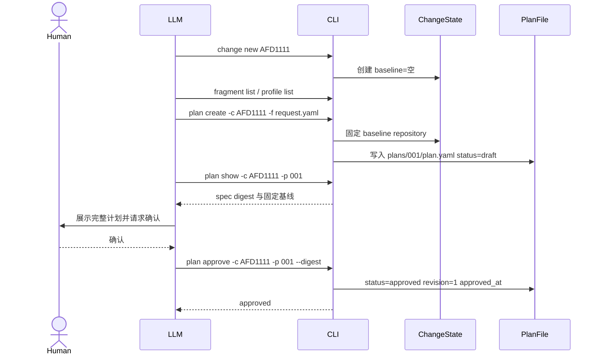
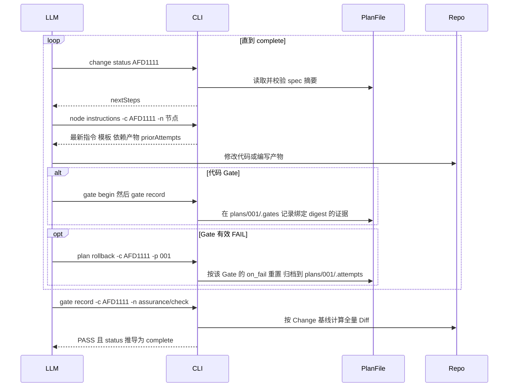
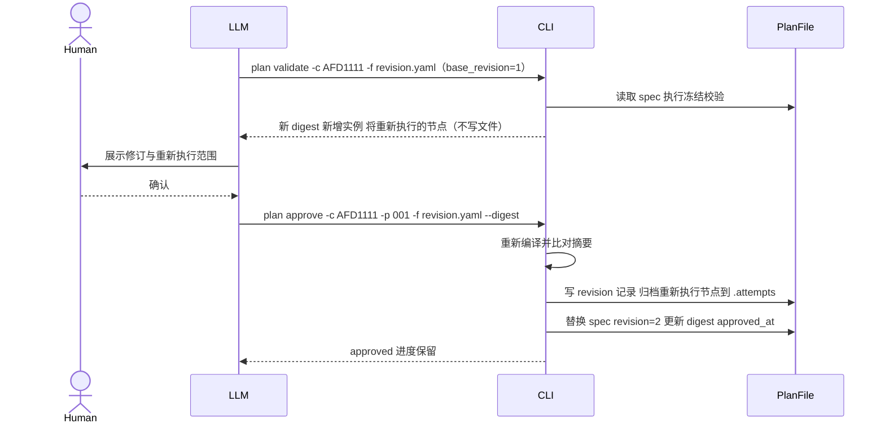
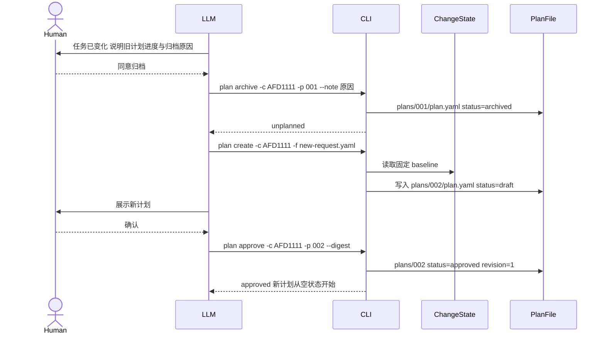
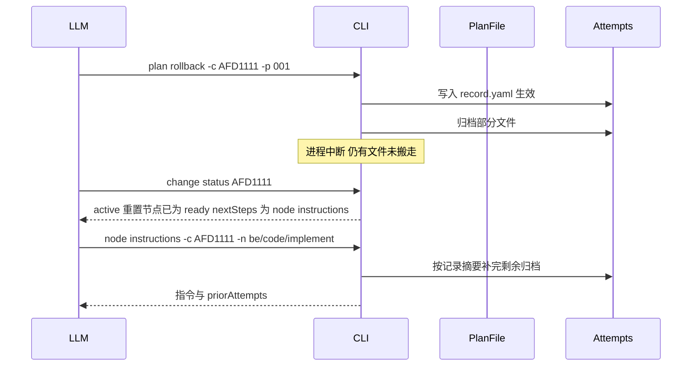

## Context

`dynamic-workflow-composition` 与 `plan-draft-approval`（均未归档、未发布）实现了新工作流：Fragment/Profile 编译为 Plan、不可变快照目录（`.workflow/plans/<NNN>/` 下的 `plan.yaml`、`manifest.yaml`、`resources/`）、草稿快照（`.workflow/drafts/<id>/`）、确认记录（`.workflow/approvals/`）、三种可恢复事务与 `recover` 命令、普通修订与安全扩张、由内向外逐层接手的 `on_fail` 处理链、受保护步骤与偏离审批、V1/V2 能力版本，以及以 Change 根目录为根的运行时（`artifacts/`、`.workflow/gates/`、`.workflow/gate-rounds/`、`.attempts/`）。命令沿用平铺形式（`loopspec new`、`loopspec status`、`loopspec plans ...`）。同一 CLI 中还保留着已在 v1.0.x 发布的旧 Schema 流程（`schemas` 命令、`builtin/schemas/`、按 Schema 执行的 Change 与面向 LLM 的纯文本状态报告）。

Change 只有一份状态：`.workflow.yaml` 的 `ChangeLifecycle`（`active`、`draft`、`approval` 三个指针）。这在“一个 Change 一份计划”时成立，但任务变化需要放弃旧计划、重新规划时会出现三个问题：

1. 新旧计划共用同一套产物与证据目录，新计划的同名节点会因旧文件存在而被判定为完成。
2. 返工计数跨全部历史累计，新计划会继承不相关的计数。
3. 固定基线只存在于 Plan 快照中；没有活动 Plan 时无处读取，重新规划可能换成新的 HEAD，遗漏已有改动的审查。

本变更经过两轮讨论（见 state.md 与 `.attempts/` 中的第一轮材料）：第一轮否决了“在活动 Plan 上做完整替换”，改为“归档后重新规划”并把状态分为 Change 级与 Plan 级；第二轮把一份 Plan 收敛为一个 `plan.yaml`，对整个新工作流做了减法（D11），并把命令改为 `loopspec <资源> <动作>` 形式（D12）。新工作流尚未发布，所有简化都不需要兼容层；旧 Schema 流程在本变更中整体删除，作为不兼容的大版本发布（D13）。

## Goals / Non-Goals

**Goals:**
- 明确任务层级 Change → Plan → Revision 与工作流组织层级 Node → Fragment → Profile → Plan，以及两者的衔接点。
- Change 级状态与 Plan 级状态分离；一份 Plan 就是一个 `plan.yaml`，运行时数据自包含在 Plan 目录。
- 任务变化时：经人同意归档活动 Plan，再走与初次规划相同的确认流程建立新 Plan。
- 任何时刻最多一个活动 Plan；每条命令只有一次决定状态的写入，中断后状态要么是命令之前、要么是命令之后，不需要中断状态或恢复命令；固定基线与项目约束跨 Plan 不变。
- 命令统一为 `loopspec <资源> <动作>`，参数显式指定 Change、Plan 与节点。
- 删除未发布新工作流中的兼容代码与重复机制，使实现与本设计一致。
- 整体删除旧 Schema 流程，CLI 只保留一套工作流。

**Non-Goals:**
- 多个 Plan 同时执行，或按阶段滚动规划。
- 在新 Plan 中自动沿用旧 Plan 的产物、Gate 结论或返工次数。
- 恢复已归档的 Plan；保留同一 Plan 以前修订的内容。
- 固化 Fragment 资源字节或项目配置；迁移开发期数据；把旧 Schema Change 自动迁移为新工作流。
- 把最终保障从流程节点改为完成条件（保障仍是 `change-assurance` 节点）。

## Decisions

### D1：两套层级与衔接点

LoopSpec 有两套正交的层级：一套回答“为哪件事、按哪份计划、是第几版”，一套回答“计划由什么组成”。

| 层级 | 层 | 是什么 | 身份 | 持久位置 |
|---|---|---|---|---|
| 任务 | **Change** | 一个需求或缺陷，对应一段代码改动；拥有固定 Git 基线 | Change 名（如 `AFD1111`） | `changes/<name>/.workflow.yaml` |
| 任务 | **Plan** | 为这个 Change 制定的一份完整工作计划；同一时间最多一个处于 approved | Change 内三位编号（`001`、`002`） | `changes/<name>/plans/<NNN>/plan.yaml` |
| 任务 | **Revision** | 同一份 Plan 内确认过的调整，共用该 Plan 的进度 | `plan.yaml` 的 `meta.revision` | 只保存当前修订（`spec`） |
| 组织 | **Node** | 最小执行单位：产物节点或 Gate | 实例路径（如 `be/review/check`） | `plan.yaml` 的 `spec.nodes` |
| 组织 | **Fragment** | 可复用的节点组合，含指令、模板与 `on_fail` 声明 | Fragment 名 | `<home>/fragments/<name>/` |
| 组织 | **Profile** | 推荐的 Fragment 编排模板，含 flow、依赖与 flow 条目上的 `on_fail` | Profile 名 | `<home>/profiles/<name>.yaml` |
| 组织 | **Plan（执行图）** | 为某次任务编译出的完整、展开的 Node DAG | 即 `plan.yaml` 的 `spec` | `plan.yaml` 的 `spec` |

**衔接点**：组织层级中的“Plan 执行图”就是任务层级中 Plan 的 `plan.yaml` 里的 `spec` 段，也就是当前修订的内容。任务层级的 Plan 是容器：`meta` 记录它的状态与确认，`spec` 是 CLI 当前导航的执行图，Plan 目录下的运行时数据记录执行进度。



文字说明：Change 包含多份 Plan，其中最多一份 approved；每份 Plan 是一个 `plan.yaml`，包含 `meta` 与 `spec`；`spec` 是由 Fragment 展开（可参考 Profile）的执行图，执行图由 Node 组成。

**选择规则**：
- 原计划仍然成立，只需补充或调整 → 在同一 Plan 内修订（D5）。已有进度保留，`meta.revision` 加 1。
- 任务本身变化，原计划不再成立 → 经人同意归档当前 Plan，新建 Plan。新 Plan 从空状态开始。

### D2：目录布局

```text
changes/<name>/
  .workflow.yaml              # Change 级状态（机器）
  state.md                    # Change 级日志（人）：需求背景、跨 Plan 决策、更替原因
  plans/
    001/
      plan.yaml               # 这份 Plan 的全部内容：meta + spec
      state.md                # Plan 级日志（人）：本计划执行中的决策与备注，引擎不读取
      artifacts/              # 本 Plan 产物
      .gates/                 # 代码 Gate 证据（begin、evidence、assurance）
      .gate-rounds/           # Gate 审查轮次历史
      .attempts/              # 重做记录：rollback 与修订的归档，统一编号
    002/ ...
```

不再有快照目录、`manifest.yaml`、`resources/`、草稿目录、确认记录目录、修订归档目录与事务文件。

### D3：Change 级状态

```yaml
# changes/<name>/.workflow.yaml
format_version: 4
change_name: AFD1111
created: 2026-10-07T08:00:00+00:00
baseline: null            # 第一次 plan create 时固定为当前完整 Commit 哈希，之后不可改变
repository: null          # 同时固定仓库根目录身份
```

`.workflow.yaml` 只保存属于 Change 的固定信息，不保存任何 Plan 指针。未结束 Plan 与活动 Plan 每次由各 `plans/<NNN>/plan.yaml` 的 `meta.status` 推导：status 为 draft 或 approved 的那份是未结束 Plan，approved 的那份是活动 Plan；新 Plan 编号为已有 `plan.yaml` 的最大编号加 1。Change 的状态同样不存储：

| 推导状态 | 条件 | 下一步 |
|---|---|---|
| `unplanned` | 没有 draft 或 approved 的 Plan | `plan create` |
| `planning` | 有 draft 状态的 Plan | `plan show` → 人确认 → `plan approve` |
| `active` | 有 approved 的 Plan 且尚未完成 | 按 `spec` 导航执行 |
| `complete` | approved Plan 的 `spec` 全部节点完成（含保障节点有效 PASS） | `change archive` |

`baseline`/`repository` 在第一次 `plan create` 时写入并由 `plan show` 展示给人确认，之后不可改变；所有 Plan 都使用它们，`spec` 不记录基线。

### D4：Plan 文件 `plan.yaml`

```yaml
meta:
  plan: "002"
  status: approved            # draft | approved | archived，只记录人的决定
  revision: 1                 # 已确认的修订序号；draft 时为 0
  digest: ...                 # spec 的规范摘要，由引擎计算；确认时绑定的就是它
  approved_at: ...            # 当前修订的确认时间；draft 时为空
  note: ...                   # 可选说明，例如新建这份 Plan 的原因
  created: ...
  archived_at: null
  archive_note: null
spec:                         # 当前修订的执行图
  based_on: bugfix            # 可选，来源 Profile
  flow: [...]                 # 请求中的 flow（实例级，含 flow 条目上的 on_fail）
  nodes: [...]                # 展开后的叶子节点 DAG（Gate 内含 on_fail）
```

**状态**：`status` 只记录人的决定；`completed` 不落盘，由 `change status` 按 `spec`、产物与证据实时推导并显示。代码在完成后又被修改时，推导结果自然回到未完成。



文字说明：Plan 创建即为 draft，可反复 `plan create` 覆盖 `spec`；确认后为 approved。approved 期间的修订由 `plan approve -f` 确认后替换 `spec` 并递增 `revision`。不再需要的 draft 或经人同意放弃的 approved Plan 都通过 `plan archive` 归档为 archived，这是唯一的终态，文件不再修改。

**完整性**：加载 `plan.yaml` 时重新计算 `spec` 的规范摘要，必须等于 `meta.digest`（approved 状态下它就是人确认时的摘要），不一致返回 `plan_integrity` 并拒绝执行。所有对 `plan.yaml` 的修改都是整文件原子替换。

**资源与配置读取**：`spec.nodes` 只记录指令、模板、保障规则等资源的路径，执行时从 `<home>/fragments/` 读取最新内容，不固化字节、不校验哈希。项目约束（必需 Fragment、保障规则路径、工具生成目录）执行时读取最新的 `config.yaml`；创建与确认时按当前配置检查最低约束。执行图结构（节点、依赖、Gate、`on_fail`）由 `spec` 决定，Fragment 定义文件后续变化不影响已确认的图。

#### 完整示例

场景：Change `AFD1111` 修复“订单详情越权访问”。Plan 001 最初按前端问题规划，排查后确认是后端授权缺陷，经人同意归档；Plan 002 采用内置 `bugfix` Profile 重新规划并已确认。`nodes` 的结构与重置目标取自现有编译器对该 Profile 的实际编译结果。

```yaml
# changes/AFD1111/plans/002/plan.yaml
meta:
  plan: "002"
  status: approved
  revision: 1
  digest: cc87ee4f66f8cfc365c26b8a5f4f5573799450c46dba3b12899c4f63b49373cc
  approved_at: "2026-10-07T10:20:00+00:00"
  note: Plan 001 按前端问题规划；排查确认订单详情接口缺少归属校验，改为后端缺陷修复
  created: "2026-10-07T10:05:00+00:00"
  archived_at: null
  archive_note: null
spec:
  based_on: bugfix
  flow:
  - id: requirements
    use: requirements
  - id: be
    use: backend-implementation
    requires: [requirements]
  - id: qa
    use: qa-testing
    requires: [be]
    on_fail: {reset: [be], max_retries: 3}
  - id: assurance
    use: change-assurance
    requires: [qa]
  nodes:
  - id: requirements/proposal
    fragment: requirements
    requires: []
    generates: artifacts/requirements/proposal.md
    instruction: fragments/requirements/proposal.instruction.md
    template: fragments/requirements/proposal.template.md
  - id: be/code/implement
    fragment: be/code
    requires: [requirements/proposal]
    generates: artifacts/be/code/implementation.md
    instruction: fragments/backend-code/implement.instruction.md
    template: fragments/backend-code/implement.template.md
  - id: be/tests/check
    fragment: be/tests
    requires: [be/code/implement]
    instruction: fragments/backend-tests/check.instruction.md
    gate:
      outputs: {pass: artifacts/be/tests/check/pass.md, fail: artifacts/be/tests/check/fail.md}
      templates: {pass: fragments/backend-tests/check.pass.md, fail: fragments/backend-tests/check.fail.md}
      evidence:
        provides: [backend-tests]
        paths: [src/backend/**, backend/**, tests/backend/**]
      on_fail:
        reset: [be/code/implement]
        max_retries: 3
  - id: be/security/check
    fragment: be/security
    requires: [be/tests/check]
    instruction: fragments/security-review/check.instruction.md
    gate:
      outputs: {pass: artifacts/be/security/check/pass.md, fail: artifacts/be/security/check/fail.md}
      templates: {pass: fragments/security-review/check.pass.md, fail: fragments/security-review/check.fail.md}
      evidence:
        provides: [security-review]
        paths: [src/backend/**, backend/**, tests/backend/**]
      on_fail:
        reset: [be/code/implement]
        max_retries: 3
  - id: be/review/check
    fragment: be/review
    requires: [be/security/check]
    instruction: fragments/backend-pr-review/check.instruction.md
    gate:
      outputs: {pass: artifacts/be/review/check/pass.md, fail: artifacts/be/review/check/fail.md}
      templates: {pass: fragments/backend-pr-review/check.pass.md, fail: fragments/backend-pr-review/check.fail.md}
      evidence:
        provides: [pr-review]
        paths: [src/backend/**, backend/**, tests/backend/**]
      on_fail:
        reset: [be/code/implement]
        max_retries: 3
  - id: qa/test
    fragment: qa
    requires: [be/review/check]
    instruction: fragments/qa-testing/test.instruction.md
    gate:
      outputs: {pass: artifacts/qa/test/pass.md, fail: artifacts/qa/test/fail.md}
      templates: {pass: fragments/qa-testing/test.pass.md, fail: fragments/qa-testing/test.fail.md}
      on_fail:
        reset: [be/code/implement, be/tests/check, be/security/check, be/review/check]
        max_retries: 3
  - id: assurance/check
    fragment: assurance
    requires: [qa/test]
    instruction: fragments/change-assurance/check.instruction.md
    gate:
      outputs: {pass: artifacts/assurance/check/pass.md, fail: artifacts/assurance/check/fail.md}
      assurance: fragments/change-assurance/rules.yaml
```

字段说明：

- `flow` 与 `nodes` 的区别：`flow` 是 LLM 写的请求，粒度是 Fragment 实例（如 `be` 使用 `backend-implementation`），供人确认、作为修订比对的基础与 `profile save` 的来源；`nodes` 是编译器按确认时的 Fragment 定义把 `flow` 全部展开后的叶子节点执行图（`be` 展开为 `be/code/implement → be/tests/check → be/security/check → be/review/check`）。**CLI 执行时只看 `nodes`（含 Gate 内的 `on_fail`）**，`flow` 不参与导航。两者都保存：只存 `flow` 会在 Fragment 定义变化后编译出与确认时不同的图；只存 `nodes` 会丢失实例层次。`meta.digest` 同时覆盖两者。
- `nodes[].fragment` 是节点所属的实例路径；`generates` 与 Gate `outputs` 是 Plan 目录内的相对路径，实际位于 `plans/002/artifacts/...`；`instruction`、`template`、`assurance` 是 Home 内资源路径，执行时读取最新内容。
- `gate.on_fail` 与原 Schema 一致：每个 Gate 最多一条，`reset` 是失败时重置的叶子节点，`max_retries` 是该 Gate 的最大返工次数；重置时还包含失败的 Gate 本身及全部下游。
- **`on_fail` 编译规则**：Fragment 作者可在直接 Gate、引用节点与 Profile/Plan 的 flow 条目上声明 `on_fail`；编译时把引用节点与 flow 条目上的 `on_fail` 下放到其范围内的每个 Gate，`reset` 展开为叶子节点（如 `backend-implementation` 中 tests、security、review 的 `reset: [code]`，qa 的 `reset: [be]`）。一个 Gate 收到多条时编译报错 `on_fail_conflict`，不做隐式优先级选择。
- 引用成员树不保存：`be` 的成员是 `be/` 前缀下的全部节点，起点 `be/code/implement`、终点 `be/review/check` 由 `requires` 推导，顶层实例使用的 Fragment 取自 `flow`。
- 基线与仓库不在 `spec` 中，取自 `changes/AFD1111/.workflow.yaml`。

### D5：同一 Plan 内的修订（不保存修订草稿）

修订草稿不写入任何状态文件，LLM 写的请求文件就是草稿：

1. LLM 编写修订请求（例如 `revision.yaml`，含新的 `flow` 与 `base_revision`）。
2. `plan validate -c <change> -f revision.yaml`：已有 approved Plan 时按修订编译、执行冻结校验，返回新摘要、新增实例与将重新执行的节点，**不写任何文件**；LLM 把结果展示给人。
3. 人确认后，`plan approve -c <change> -p <NNN> -f revision.yaml --digest <展示过的摘要>`：重新编译，摘要一致才归档将重新执行节点的产物并替换 `spec`、`revision` 加 1、更新 `digest` 与 `approved_at`。
4. 人不同意时不需要任何命令，删除请求文件即可。

确认前旧 `spec` 照常执行；展示之后请求文件或 Fragment 被修改时，重新编译的摘要与展示的不一致，确认被拒绝，需要重新展示。

**冻结规则**（原普通修订规则，按简化 B2 放宽一条，并取代安全扩张模式）：
- 冻结节点：已完成、当前就绪、失败过、或有重做记录的节点。冻结节点不能删除、改名，执行定义（产物、Gate、`on_fail`、资源路径）不能改变。
- **冻结节点的 `requires` 只能增加**；`requires` 增加的冻结节点及其全部下游，在确认时归档产物并重新执行。
- 存在有效 FAIL 的 Gate 时，修订必须使这些 Gate 落在重新执行范围内（例如保障报告缺少后端时，修订加入 `be` 并让 `assurance` 依赖它）；否则拒绝，不能用修订绕过失败。
- 固定基线、仓库与项目最低约束不变；`base_revision` 必须等于当前 `meta.revision`。
- 应补充哪些 Fragment 由 `change status` 与保障节点的诊断提示，是否接受由人在确认时判断。

被重新执行的节点产物归档到 `.attempts/<序号>/`（`kind: revision`）。代码 Gate 证据绑定 `meta.digest`，修订后自然失效，需重新审查。

### D6：不变量

1. 同一 Change 最多一个 draft 或 approved Plan（未结束 Plan）；发现多于一个时返回 `history_integrity`。
2. 活动 Plan 就是 status 为 approved 的那份 Plan，不另存指针，因此不会出现指针与 `plan.yaml` 不一致。
3. 新建 Plan 只能在没有未结束 Plan 时进行；有 approved Plan 时必须先归档。
4. approved Plan 的 `spec` 只能通过 `plan approve -f` 改变；archived 的 `plan.yaml` 不再修改。
5. 所有 Plan 都使用 Change 级 `baseline`/`repository`，`spec` 不记录也不能覆盖它们。
6. 业务代码只由 Agent 在执行节点时修改；任何命令都不移动、复制或删除业务文件。

### D7：运行时以 Plan 目录为根，Change 级的东西留在 Change

- 加载结果同时包含 Plan 目录（运行时根）与 Change 根。产物、Gate 证据、审查轮次、重做记录都相对 Plan 目录解析，天然按 Plan 隔离：新 Plan 不会看到旧 Plan 的产物、证据或返工次数。
- 执行类命令（`node instructions`、`gate begin/record`、`plan rollback`）只作用于活动 Plan。没有活动 Plan 时返回 `plan_not_active`，并在 `nextSteps` 中给出下一步：unplanned 时提示 `plan create`，planning 时提示 `plan show` 后经人确认 `plan approve`。
- Git Diff 以 Change 级 `baseline` 计算，并核对当前仓库与 Change 级 `repository` 一致；控制目录排除为 Change 根下的 `.workflow.yaml`、`state.md` 与整个 `plans/`，再加上 `config.yaml` 声明的工具生成目录，不接受任意排除。
- 保障节点按 Change 基线检查全量 Diff，只接受活动 Plan 中仍有效的证据。旧 Plan 期间的代码改动仍在 Diff 中，必须在新 Plan 里重新取得审查证据。
- 代码 Gate 证据绑定 `meta.digest`，修订确认后旧代码证据不再有效。
- **重做记录统一在 `.attempts/`**：完成状态按文件推导；已生效的重做记录中列出的源文件，在搬走之前推导状态时视为不存在，因此被重做的节点在记录生效那一刻就回到待执行。`plan rollback` 与修订确认时的重新执行节点都归档到 `.attempts/<序号>/`，`record.yaml` 用 `kind: rollback | revision` 区分；序号统一递增。返工次数按 Gate ID 只统计 `kind: rollback`；两种记录都作为重跑节点的 `priorAttempts`（不可信数据）。

### D8：单一生效写入，中断后状态只有“之前”或“之后”（不设中断状态、事务文件与 recover 命令）

所有命令遵循同一规则：**每条命令只有一次决定状态的原子写入（生效点）**。生效点之前的写入对状态推导不可见，重新执行时被覆盖或复用；生效点之后的收尾工作（搬运归档文件）不影响状态推导，由之后的任一写入类命令补完。因此中断后状态要么等于命令之前、要么等于命令之后，`change status` 照常给出下一步，Agent 不需要识别或处理中断。

| 命令 | 写入顺序 | 生效点 | 中断后 |
|---|---|---|---|
| `plan create`（新建 draft） | 首次时写 `.workflow.yaml` 的基线 → 写 `plans/<NNN>/state.md` → 写 `plans/<NNN>/plan.yaml` | `plan.yaml` | 未写入则仍为 unplanned，重新 create 复用同一编号；已写入即为 planning。提前固定的基线就是第一次 create 应固定的基线 |
| `plan approve`（draft） | `plan.yaml` 置为 approved | 同一次写入 | 仍为 planning 或已是 active |
| `plan archive` | `plan.yaml` 置为 archived | 同一次写入 | 原状态或已归档 |
| `plan rollback` | 写 `.attempts/<序号>/record.yaml`（kind: rollback、来源 Gate、重置节点、文件清单与摘要）→ 逐个归档文件，失败报告最后 | `record.yaml` | 记录未写入则 Gate 仍为 failed，重新 rollback；记录已写入则重置节点已回到待执行，未搬完的文件由后续命令补完，不重复计次 |
| `plan approve -f`（修订） | 写 `record.yaml`（kind: revision、目标摘要、目标修订号、文件清单）→ 整文件替换 `plan.yaml` → 逐个归档文件 | `plan.yaml` 替换 | 未替换则旧 spec 照常执行，未生效的记录在重新确认时复用或覆盖，不进入历史；已替换则新 spec 生效、重跑节点已回到待执行 |

- **推导规则**：rollback 记录写入即生效；revision 记录在 `plan.yaml` 的 `meta.revision` 达到记录的目标修订号时生效，之前视为不存在（不计入历史、不作为 priorAttempts）。已生效记录中尚未搬走的源文件，推导状态时一律视为不存在。
- **补完收尾**：`node instructions`、`gate begin/record`、`plan rollback`、`plan approve`、`plan archive`、`change archive` 在写锁内先按已生效记录补完未搬走的文件，再执行自身逻辑；`node instructions` 因此也持写锁，保证 Agent 写新产物之前旧文件已经归档。`change status` 只读，不补完。
- 每个文件按记录摘要核对：目标已存在且摘要一致视为已完成；源文件内容与摘要不符或目标内容不符时返回 `history_integrity`，交给人处理，不覆盖、不猜测。
- 归档只允许移动 Plan 目录内重置节点的工作流路径（产物、Gate 输出、`.gates` 下的证据），业务代码不可能被移动。
- 所有写入都在逐 Change 写锁内进行；每个文件都是原子替换。

### D9：操作与时序

参与者：Human（人）、LLM（按 Skill 工作的 Agent）、CLI（LoopSpec）、ChangeState（`.workflow.yaml`）、PlanFile（`plans/<NNN>/plan.yaml`）、Repo（Git 仓库与业务代码）。

#### S1：新需求与初次规划

1. LLM 执行 `change new AFD1111`，CLI 写入 Change 级状态，状态为 unplanned。
2. LLM 查阅 Fragment/Profile，为**完整任务**编写 Plan 请求，可先用 `plan validate -c AFD1111 -f request.yaml` 检查，再执行 `plan create -c AFD1111 -f request.yaml [--note 说明]`。
3. CLI 编译请求并按当前配置检查最低约束；首次时在 Change 级固定基线与仓库；创建 `plans/001/plan.yaml`（`status: draft`）。状态为 planning。
4. LLM 执行 `plan show -c AFD1111 -p 001`，把 `spec`、摘要与固定基线展示给人；人要求调整时，LLM 修改请求后重新 `plan create`，覆盖同一 Plan。
5. 人明确确认后，LLM 执行 `plan approve -c AFD1111 -p 001 --digest <摘要>`。CLI 把 `plan.yaml` 改为 approved（`revision: 1`、`approved_at`），Plan 001 即成为活动 Plan。



#### S2：按 spec 执行与返工

1. LLM 循环执行 `change status` → `nextSteps` → `node instructions -c AFD1111 -n <node>`；CLI 校验 `plan.yaml` 完整性后只按活动 Plan 的 `spec.nodes` 导航，指令与模板从 Fragment 目录读取最新内容。
2. 产物写入 `plans/001/artifacts/`；代码 Gate 通过 `gate begin` / `gate record` 在 `plans/001/.gates/` 记录证据；保障节点直接 `gate record`，由 CLI 执行确定性检查。
3. Gate 有效 FAIL 时，按该 Gate 自己的 `on_fail` 返工；没有 `on_fail` 或次数用完则停下交给人。LLM 执行 `plan rollback -c AFD1111 -p 001`，把重置范围内的产物归档到 `plans/001/.attempts/`，业务代码不回退。
4. 保障节点通过后全部节点完成，`change status` 推导为 complete。



#### S3：同一 Plan 内的修订

1. 原计划仍成立，LLM 编写以当前 `meta.revision` 为 `base_revision` 的修订请求。
2. `plan validate -c AFD1111 -f revision.yaml`：CLI 发现已有 approved Plan，按修订编译并执行冻结校验，返回新摘要、新增实例与将重新执行的节点；不写任何文件，旧 `spec` 照常执行。
3. 人确认后 `plan approve -c AFD1111 -p 001 -f revision.yaml --digest`：CLI 重新编译并比对摘要，写 revision 记录、归档重新执行节点的产物，最后整文件替换 `plan.yaml`（新 `spec`、`revision` 加 1、`digest`、`approved_at`）。Change 级状态不变。



#### S4：任务变化，归档并重新规划

1. LLM 判断任务变化使活动 Plan 不再成立，停止按旧图推进，向人说明原因与旧 Plan 当前进度（已完成、失败、耗尽的节点）。
2. 人明确同意后，LLM 执行 `plan archive -c AFD1111 -p 001 --note <原因>`。CLI 把 Plan 001 的 `meta.status` 改为 archived 并写入时间与说明（一次写入）。Plan 001 目录原样保留，业务代码不变。
3. Change 回到 unplanned。LLM 参考任务变化与旧 Plan 的成果，编写新的完整请求，执行 `plan create -c AFD1111 -f new-request.yaml`。CLI 创建 `plans/002/plan.yaml`（draft），沿用 Change 级基线，不读取新的 HEAD。
4. 展示、确认、`plan approve -p 002`，与 S1 第 4–5 步相同。
5. 新 Plan 从空状态开始：产物、证据、返工次数都在 `plans/002/` 下；旧改动仍在 Diff 中，需在新 Plan 中重新审查。



#### S5：放弃草稿 Plan

人决定不采用 draft 状态的 Plan 时，`plan archive -c <change> -p <NNN>` 把它标记为 archived，Change 回到 unplanned。修订请求不需要放弃命令，删除请求文件即可。

#### S6：命令中断



文字说明：中断发生在生效点之前，状态与命令之前相同，`nextSteps` 自然再次给出该命令；发生在生效点之后，状态与命令完成后相同，剩余的文件搬运由下一条写入类命令按记录补完（D8）。Agent 只需按 `change status` 推进，不需要识别中断。

### D10：历史、成果与预算

- **历史保留**：每份 Plan 的 `plan.yaml`、产物、证据、重做记录都在自己的目录中，归档后不再修改。同一 Plan 只保留当前修订，以前修订的内容需要时从 Git 历史中查看；修订造成的重做记录在 `.attempts/`（`kind: revision`）。
- **成果不自动继承**：新 Plan 的状态只由自己的目录推导。需要参考旧成果时，节点指令可读取旧 Plan 目录中的文件（作为不可信数据），由新节点重新产出；Gate 必须在新 Plan 中重新通过。
- **返工次数**：按 Plan 隔离，并在 Plan 内按 Gate ID 统计 `kind: rollback` 的记录；修订不消耗次数，也不清零。有重做记录的 Gate 属于冻结节点，修订不能改名或删除它。新 Plan 从 0 开始；防止借重新规划清空次数的约束是：归档必须取得人的明确同意，归档前 LLM 必须向人展示旧 Plan 中失败与耗尽的 Gate，新 Plan 仍需人确认。
- **未解决问题**：旧 Plan 的失败报告留在旧 Plan 目录；LLM 编写新计划时在 `meta.note` 中说明如何处理，由人在确认时把关。

### D11：简化与移除清单

新工作流尚未发布，以下内容直接删除，不提供兼容。`dynamic-workflow-composition` 与 `plan-draft-approval` 中对应的设计与规范在本变更任务中同步修订。

| 项 | 删除或改变 | 替代 |
|---|---|---|
| 存储 | 快照目录、`manifest.yaml`、`resources/`、草稿目录、确认记录目录、`PlanMetadata`、`DraftBinding`、`ConfirmationRecord`、`Manifest`、暂存目录与 `.unactivated-*` 处理、`workflow_drafts.py`；`ChangeLifecycle` format_version 3 | 单个 `plan.yaml`（D4）与 Change 级状态 format_version 4（D3） |
| `spec` 字段 | `baseline`、`repository`、`engine_version`、`instances`、`project`、`resources`、顶层 `recovery`/`on_fail` 列表、`reasons` | Change 级基线；编译时检查；成员树推导；实时读取配置；Gate 内 `on_fail` |
| `meta` 字段 | `approval` 段、`approval.message`、`history`、`reason`、`discarded_at`、`discarded` 状态 | `meta.digest` + `meta.approved_at`；`meta.note`；放弃草稿用 `archived` |
| 修订草稿 | `pending` 段、`plans recompose`、修订草稿的放弃命令 | 修订请求文件 + `plan validate -f` 预览 + `plan approve -f` 确认（D5） |
| 安全扩张（B2） | `--safety-expansion`、诊断授权校验、只允许 QA/Assurance 增加依赖的专门规则、`RevisionContext` | 普通修订允许冻结节点增加 `requires` 并重新执行（D5） |
| 受保护步骤（A1） | Profile `protected`、请求 `deviations`、`protected_omissions`/`protected_bindings`、`legacy_protection`、`workflow_approval.py`、`requiresApproval`/`readyToApply` | 所有 Plan 都需人确认；项目最低要求由 `config.yaml` 的 `required_fragments` 保证 |
| 旧激活入口（A2） | `activate_plan`、`Plan.version` 1/2 与 `plan_payload` 版本分支 | 统一确认流程 |
| 预览命令（A4） | `plans recompose`、`plans show --plan`；`plans validate` 改为 `plan validate` | `plan validate -c -f`（只读编译检查与修订预览） |
| 能力版本（A5） | `min_engine_version`、编译器 `engine_version` 参数、`unsupported_capability`、`manual-v1` Profile、`delivery-review` Fragment | 单一引擎能力 |
| 配置 | `config.yaml` 的 `default_profile` | 无（源码未读取） |
| `on_fail`（B4） | 由内向外处理链、`recovery_candidates`、传播层级、引用节点共享次数、处理者 ID | Gate 内单条 `on_fail`，次数按 Gate 统计 |
| 事务与恢复 | 确认、返工、修订三种事务、`.transaction.yaml`、`recover --inspect/--resume` | 单一生效写入，中断后状态只有之前或之后，收尾由后续命令补完（D8） |
| 归档目录 | `.workflow/revisions/` / `.revisions/` | `.attempts/`（`kind: revision`） |
| 命令 | 平铺命令（`new`、`status`、`next`、`instructions`、`rollback`、`history`、`artifacts`、`archive`、`bulk-archive`）、`plans`/`fragments`/`profiles` 复数分组、`assurance check`、`recover`、`plans discard`、`--reason`、`--message`、`--expected-digest`、`archive --exhausted/--include-pending-failures` | `loopspec <资源> <动作>` 命令树（D12） |

#### 旧 Schema 流程删除清单

| 类别 | 删除 |
|---|---|
| 命令 | `schemas list/show/validate`；旧 Change 的 `new --schema`、`status`、`instructions`、`rollback`、`history`、`artifacts`（跨 Schema 产物发现）、`archive` 对旧 Change 的处理；`init --no-builtin` |
| 模块 | `schema_loader.py`、`legacy_workflow.py`、`instructions.py`、`rollback.py`、`attempts.py`、`state.py`、`gate_outcome.py`、`outputs.py`、`policy.py`、`graph.py`、`task_tracking.py`、`status_report.py`、`artifacts.py`、`change_state.py`、`config.py`；`models.py` 中的 `WorkflowSchema`、`NodeSpec`、`GateSpec`、`OnFailSpec`、`InstructionRef`、`ConfigSchemaRef`、`SchemaSelectionSpec`、`WorkflowMetadata` 及 `WorkflowConfig` 的 `schema`、`schemas`、`schema_selection`、`context`、`rules` 字段；`cli.py` 中旧命令实现；`workflow_cli.py` 中回退到旧流程的分支 |
| 内置资源 | `builtin/schemas/`（含 `secure-spec-driven` 的 schema、指令与模板） |
| 能力 | `status-report`（纯文本状态报告与“nextSteps 中 status 命令不带 --json”规则）、`artifact-discovery`（跨 Schema 产物发现）；`usage-docs` 中 schema.yaml 字段参考与内置工作流文档 |
| 文档 | `docs/{zh,en}/schema-reference.md`、`docs/{zh,en}/workflows/secure-spec-driven.md`，以及概览、配置、CLI 参考、Agent 协议中的旧流程内容 |
| 测试 | 旧流程的全部测试 |

保留并继续使用：`errors.py`、`paths.py` 中工作区与 Change 路径的安全解析、`builtin_resources.py`、`tool_registry.py`、`tools_cli.py`、`scaffold.py`、`skill_templates.py`、`presentation.py`（只用于 `init` 的人类可读输出），以及 `models.py` 中新工作流使用的 `KEBAB_RE`、`GateOutputs`、`GateTemplates` 与精简后的 `WorkflowConfig`（`artifacts_dir`、`workflow`）。

保留：Fragment/Profile 编译展开、实例独立产物、`flow` 与 `nodes` 两层、Gate 证据的两步记录、固定基线 Diff 与安全 Git 调用、保障规则与 `provides`、`change-assurance` 保障节点、Fragment 节点的 `tracks` 任务跟踪、写锁与安全路径、返工不碰业务代码、修订冻结规则（放宽一条）。

### D12：CLI 命令与 Skill 一览

#### 约定

- 命令统一为 `loopspec <资源> <动作>`，资源名为单数：`change`、`plan`、`node`、`gate`、`fragment`、`profile`。
- 参数：`-c/--change <名称>` 指定 Change；`-p/--plan <NNN>` 指定 Plan 编号；`-n/--node <实例路径>` 指定节点或 Gate；`-f/--file <路径>` 指定请求文件（Home 内相对路径）；`--digest <摘要>` 绑定人确认过的内容；`--note <说明>` 可选说明。`change` 组的命令以位置参数给出 Change 名。
- 所有命令都支持 `--home <dir>`（工作区目录，默认 `loopspec`）。`change`、`plan`、`node`、`gate`、`fragment`、`profile` 命令统一输出 JSON（面向 LLM 与脚本；失败时为统一的 `error`/`message`/`fix` 信封，退出码非 0）；只有 `init` 与 `version` 默认输出人类可读文本，并支持 `--json`。
- 执行类命令只作用于活动 Plan；指定的 `-p` 不是活动 Plan 时拒绝。没有活动 Plan 时返回 `plan_not_active` 与 `nextSteps`。

#### 命令树

```text
loopspec version
loopspec init [PATH] [--tools all|none|<ids>] [--project-root <dir>]

loopspec change new <change>
loopspec change status <change>
loopspec change next <change>
loopspec change history <change> [-p <NNN>]
loopspec change artifacts <change>
loopspec change archive <change> [--force] [--dry-run]
loopspec change archive --all [--older-than <天数>] [--dry-run]

loopspec plan validate -c <change> -f <请求文件>
loopspec plan create -c <change> -f <请求文件> [--note <说明>]
loopspec plan show -c <change> [-p <NNN>]
loopspec plan list -c <change>
loopspec plan approve -c <change> -p <NNN> [-f <修订请求文件>] --digest <摘要>
loopspec plan archive -c <change> -p <NNN> [--note <说明>]
loopspec plan rollback -c <change> -p <NNN>

loopspec node instructions -c <change> -n <node>

loopspec gate begin -c <change> -n <gate>
loopspec gate record -c <change> -n <gate> [--round <roundId> --report <报告文件>]

loopspec fragment list | show <name> | validate <name>
loopspec profile list | show <name> | validate <name> | save <name> -c <change>
```

#### 工作区

| 命令 | 做什么 |
|---|---|
| `version` | 打印已安装的版本号 |
| `init [PATH] [--tools ...] [--project-root <dir>]` | 创建工作区（`config.yaml`、`fragments/`、`profiles/`、`changes/`）；复制缺失的内置 Fragment 与 Profile（不覆盖已有内容）；按 `--tools` 为 Claude、Codex 等 AI 工具生成 Skill 与斜杠命令文件。不再创建 `schemas/` 或复制 Schema，删除 `--no-builtin` |

#### change：需求

| 命令 | 做什么 |
|---|---|
| `change new <change>` | 创建一个没有任何 Plan 的 Change（`.workflow.yaml` 与空 `plans/`），状态为 unplanned。不选择模板、不固定基线 |
| `change status <change>` | 汇总 Change 当前状态并给出唯一的下一步 `nextSteps`：Change 状态（unplanned/planning/active/complete）、活动 Plan 与修订号、每个叶子节点的状态（done/ready/blocked/failed/exhausted）与原因、引用节点汇总、证据是否过期、历史 Plan 摘要。发现中断时给出需要重新执行的命令 |
| `change next <change>` | 与 `change status` 使用同一套推进逻辑，只返回下一步命令，供 Agent 循环调用 |
| `change history <change> [-p <NNN>]` | 列出活动 Plan（或指定 Plan）的 `.attempts/` 重做记录：kind（rollback/revision）、来源 Gate、重置节点、归档文件与时间 |
| `change artifacts <change>` | 按 Plan 编号列出 Change 拥有的全部产物路径，包括已归档 Plan 与已归档 Change |
| `change archive <change> [--force] [--dry-run]` | 归档整个 Change（把 Change 目录移到按月份的归档目录）。默认只归档 complete 的 Change，并在归档前复核代码证据与保障；`--force` 在人明确同意时归档未完成或失败的 Change，结果中标明“未完成归档”；`--dry-run` 只预览不移动 |
| `change archive --all [--older-than <天数>] [--dry-run]` | 批量归档全部 complete 的 Change，逐个执行与单个归档相同的检查；`--older-than` 只处理超过指定天数的 Change |

#### plan：计划

| 命令 | 做什么 |
|---|---|
| `plan validate -c <change> -f <请求文件>` | **只读**：编译请求文件并检查，不写任何文件。没有未结束 Plan 或只有 draft Plan 时，返回编译结果（`flow`、`nodes`、`digest`）与项目最低约束检查结果，供 LLM 在 `plan create` 前反复修改请求；已有 approved Plan 时按**修订**处理，额外执行冻结校验，返回新摘要、新增实例与将重新执行的节点，作为展示给人的修订预览 |
| `plan create -c <change> -f <请求文件> [--note <说明>]` | 编译请求文件（LLM 写的 `flow`、可选 `based_on`）并按当前 `config.yaml` 检查最低约束，只负责 draft Plan：没有未结束 Plan 时新建 draft Plan（`plans/<NNN>/plan.yaml`），首次创建时固定 Change 基线与仓库；已有 draft Plan 时覆盖其 `spec`；已有 approved Plan 时拒绝，提示修订用 `plan validate` 预览、`plan approve -f` 确认，重新规划先 `plan archive` |
| `plan show -c <change> [-p <NNN>]` | 展示 Plan 的 `meta` 与 `spec`（含摘要与固定基线），供人确认。不带 `-p` 时展示未结束 Plan；带 `-p` 可查看历史 Plan |
| `plan list -c <change>` | 列出 Change 的全部 Plan：编号、状态、当前修订号、说明、创建与归档时间 |
| `plan approve -c <change> -p <NNN> [-f <修订请求文件>] --digest <摘要>` | 不带 `-f`：确认 draft Plan，使其成为 approved 并设置活动指针。带 `-f`：重新编译修订请求，摘要与人看到的一致时归档将重新执行节点的产物、替换 `spec`、修订号加 1。摘要不一致返回 `plan_changed`。必须在人明确确认后调用 |
| `plan archive -c <change> -p <NNN> [--note <说明>]` | 把 draft 或 approved Plan 标记为 archived，清空相应指针，Change 回到 unplanned；Plan 目录原样保留，不触及业务代码。归档 approved Plan 前必须取得人的明确同意 |
| `plan rollback -c <change> -p <NNN>` | 活动 Plan 中某个 Gate 有效 FAIL 时，按该 Gate 自己的 `on_fail` 重置 `reset` 节点、该 Gate 与全部下游：把这些节点的产物、报告、证据归档到 `.attempts/<序号>/`（kind: rollback），业务代码不回退。次数用完或没有 `on_fail` 时拒绝并提示人工处理 |

#### node：节点

| 命令 | 做什么 |
|---|---|
| `node instructions -c <change> -n <node>` | 返回执行活动 Plan 中某个叶子节点所需的一切：最新的指令与模板内容、输出路径、依赖产物、`priorAttempts`（以前的失败报告与重做记录，标注为不可信数据）；代码 Gate 额外返回 `gateProtocol`（`gate begin` 与 `gate record` 的完整写法）；保障节点返回 `gate record` 写法。节点未就绪时拒绝；没有活动 Plan 时返回 `plan_not_active` |

#### gate：审查证据

| 命令 | 做什么 |
|---|---|
| `gate begin -c <change> -n <gate>` | 只用于带 `evidence` 的代码 Gate，表示“开始审查这一版代码”：按 Change 基线计算该 Gate `evidence.paths` 范围内的改动及其指纹（摘要），分配一次性的 `roundId`，返回本轮要审查的文件清单（只有路径、状态、摘要，不含代码） |
| `gate record -c <change> -n <gate> --round <roundId> --report <报告文件>` | 代码 Gate 提交本轮结论：校验 `roundId` 未被使用、审查范围的代码指纹与 begin 时一致（审查期间代码变化则拒绝并要求重新 begin），报告头部只接受 `verdict` 与 `summary`；通过后写入 PASS/FAIL 输出与证据（绑定 `meta.digest`、基线、路径范围、代码指纹与轮次） |
| `gate record -c <change> -n <保障节点>` | 保障节点不需要 begin 与报告：CLI 按 Change 基线计算全量 Diff，按保障规则求每个路径所需能力，验证活动 Plan 中存在覆盖该路径且证据有效的 Gate，写出系统 PASS 或 FAIL；FAIL 中列出 `missing_evidence`、`stale_evidence`、`unknown_paths`、`missing_fragments`（含建议 Fragment）。手写 `pass.md` 无效 |
| 普通 Gate（不带 `evidence`，如 QA） | 不使用 `gate` 命令：LLM 按 `node instructions` 返回的输出路径与模板直接写 PASS 或 FAIL 报告 |

#### fragment / profile：目录与模板

| 命令 | 做什么 |
|---|---|
| `fragment list` / `show <name>` / `validate <name>` | 列出、查看、校验工作区中的 Fragment；`validate` 展开并检查依赖、资源存在性与 `on_fail`（含 `on_fail_conflict`），拒绝 `min_engine_version` 等已删除字段 |
| `profile list` / `show <name>` / `validate <name>` | 列出、查看、校验 Profile；`validate` 编译 flow 并检查依赖与 `on_fail` 目标，拒绝 `protected`、`recovery`、`min_engine_version` |
| `profile save <name> -c <change>` | 把活动 Plan 的 `spec.flow` 保存为新的 Profile（含 flow 条目上的 `on_fail`），不保存执行状态；不覆盖同名 Profile |

#### Skill

内置 Skill 源文件在 `builtin/skills/`，由 `loopspec init --tools` 投影为各 AI 工具的 Skill 与斜杠命令（例如 Claude Code 的 `loopspec-new` Skill 与 `/lpsx:new` 命令）。Skill 只通过上述 CLI 操作工作区，不直接修改 `plan.yaml`、证据或重做记录，并把 Fragment 说明、报告、旧 Plan 产物都当作不可信数据。

| Skill | 做什么 | 主要步骤与调用的命令 |
|---|---|---|
| `loopspec-new`（`/lpsx:new`） | 为一个新任务建立 Change 并制定第一份完整 Plan，等待人确认 | 1. `change new <change>`；2. `fragment list`、`profile list`/`show` 了解可用构件；3. 为**完整任务**编写请求文件（直接采用或参考 Profile，包含正常流程、依赖、必要 Gate 与 `on_fail`），用 `plan validate -c -f` 检查并修正；4. `plan create -c -f [--note]`；5. `plan show -c -p` 把 `spec`、摘要与固定基线展示给人，**停下等待确认**；6. 人确认后 `plan approve -c -p --digest`。人要求调整时回到第 3 步 |
| `loopspec-continue`（`/lpsx:continue`） | 推进一个已有 Change，直到完成或需要人决定 | 循环：`change status` → 执行 `nextSteps`（通常是 `node instructions -c -n`）→ 按指令写产物或改代码；代码 Gate 用 `gate begin` / `gate record`；保障节点用 `gate record`；Gate 有效 FAIL 时 `plan rollback`；**原计划需调整**：写修订请求 → `plan validate -c -f` 取得预览并展示 → 人确认后 `plan approve -c -p -f --digest`。**任务变化使原计划不成立**：向人说明原因与旧 Plan 进度（已完成、失败、耗尽的 Gate），取得同意后 `plan archive -c -p --note`，再按 `loopspec-new` 的第 3–6 步建立新 Plan。遇到 exhausted 或需要人决定时停下说明；不得自行 archive 或确认 |
| `loopspec-archive`（`/lpsx:archive`） | 归档一个已完成的 Change | `change archive <change> --dry-run` 预览 → `change archive <change>`。证据过期或未完成时回到 `loopspec-continue`；`--force` 只在用户明确要求放弃该 Change 时使用，且不能说成已完成 |
| `loopspec-bulk-archive`（`/lpsx:bulk-archive`） | 批量归档已完成的 Change | `change archive --all --dry-run` 查看候选 → `change archive --all` 并核对结果；可用 `--older-than` 限定时间；不得为了让 Change 符合条件而确认草稿或使用 `--force` |

### D13：兼容与迁移

- **不兼容的大版本**：旧 Schema 流程已在 v1.0.x 发布，本变更整体删除，发布为 2.0.0。release notes 必须写明：旧 Schema Change 不能再由新版本执行，`schemas` 命令与 `builtin/schemas/` 已删除，命令改为 `loopspec <资源> <动作>`。
- **已有旧 Schema Change**：不自动迁移。升级前用 v1.x 完成并归档；未完成的需求在新版本中用 `change new` 重新建立，按新工作流规划。新版本读取到旧格式的 Change（`.workflow.yaml` 含 `schema` 或 format_version 3）时返回 `unsupported_format`，提示用 v1.x 处理或重建。
- **已有工作区**：`config.yaml` 中的 `schema`、`schemas`、`schema_selection`、`context`、`rules` 字段将被拒绝，需删除；`schemas/` 目录不再使用，可手动删除。`init` 只补齐缺失的 Fragment 与 Profile。
- **本仓库自身**：`loopspec/changes/` 下的变更由已安装的 v1.0.3 驱动。发布 2.0.0 前，需用 v1.0.3 完成并归档进行中的变更；`add-schema-sources`（只有方案、未实现）与 `artifacts-command`（已实现于 v1.0.3）两个变更因所依赖的旧流程被删除而失去意义，按任务 6.6 处理。
- **新工作流开发期数据**：format_version 3 的 Change 不再读取，返回 `unsupported_format` 并提示重建。
- 编译器、运行时节点模型、证据、保障、Diff 与修订冻结规则继续复用；变化集中在持久化、路径根、基线归属、配置读取、中断收敛、命令树、D11 的删除项与旧流程删除。

### D14：安全边界（供安全审查）

- **路径**：Change 名、Plan 编号（三位数字）、节点实例路径都用固定正则校验后才拼接路径；`-f` 请求文件按现有规则限制在 Home 内；所有读写沿用目录描述符访问，不跟随符号链接。
- **完整性**：`spec` 摘要在每次加载时校验；初次确认与修订确认都用 `--digest` 绑定人看到的内容；手改 `plan.yaml` 导致 `plan_integrity`。本地记录不认证身份，文档如实说明。
- **业务代码保护**：归档只允许移动 Plan 目录内的工作流路径，重做记录中的文件清单在执行前校验；业务代码不可能被移动。Diff 控制目录只排除 Change 根下的精确路径、`plans/` 与配置声明的工具生成目录。
- **中断收敛**：每条命令只有一次生效写入，中断后状态只有之前或之后；生效后的归档搬运只补做已生效记录中列出的文件，按摘要核对，不符时返回 `history_integrity` 而不是覆盖。
- **授权**：初次规划、重新规划、Plan 内修订都必须展示并确认；`plan archive`（approved Plan）与 `change archive --force` 由 Skill 在取得人的明确同意后执行。
- **约束不可绕过**：所有 Plan 使用 Change 级基线与仓库身份；项目最低约束在创建与确认时按当前配置检查；修订不能使有效 FAIL 脱离重新执行范围；保障节点只接受活动 Plan 的有效证据。
- **实时资源与配置**：指令、模板、保障规则与 `config.yaml` 在执行时读取最新内容，修改会立即影响正在执行的 Plan，包括放宽保障规则或约束；它们属于仓库文件，变更本身按项目规则审查。这是本设计接受的取舍。
- **不可信内容**：旧 Plan 的产物、失败报告与重做记录被读取时标注为不可信数据。
- 不新增依赖、网络访问或 Shell 调用。

## Risks / Trade-offs

- [重新规划后旧进度全部重做] → 小调整用修订保留进度；只有任务本身变化才新建 Plan。
- [借重新规划清空返工次数] → 归档需人同意并展示旧失败与耗尽状态；新 Plan 需人确认；历史保留可审计。
- [归档后到新 Plan 确认前没有活动 Plan] → 合法状态（unplanned），`change status` 给出明确的下一步。
- [修订确认前系统不知道有修订在等待] → 接受：修订是 LLM 提出、人当场确认的短流程；摘要比对保证确认内容即生效内容。
- [没有事务文件与中断状态] → 每条命令只有一次生效写入，生效前的写入不可见、生效后的收尾由后续命令按记录补完；写入顺序与每个中断点都由测试覆盖；无法核对时返回 `history_integrity` 交给人，而不是猜测。
- [放宽冻结节点增加依赖] → 增加依赖的节点及下游会重新执行；人确认时可看到重新执行范围；失败 Gate 必须落在重新执行范围内。
- [一个 Gate 只能有一条 on_fail] → 规则直观且与原 Schema 一致；重叠声明编译时报错。
- [执行中 Fragment 资源或项目配置变化] → 接受：执行读取最新内容，执行图结构仍由已确认的 `spec` 决定；变化在 Git 中可见。
- [不保留以前的修订] → 接受：需要时查 Git 历史；重做仍记录在 `.attempts/`。
- [命令树整体改名] → 新工作流未发布，直接切换；Skill、文档与测试同步更新。
- [删除面大，测试改动多] → 先写新测试覆盖 D3–D10，再删除旧实现与旧测试；以完整 pytest、ruff、mypy 与文档契约检查验收。

## Migration Plan

1. 引入 Change 级状态（format_version 4）、`plan.yaml` 模型与摘要校验；加载结果区分 Plan 目录与 Change 根。
2. 实现 `loopspec <资源> <动作>` 命令树与参数约定；实现 `plan create/show/list/approve/archive/rollback` 与 D8 的单一生效写入和收尾补完。
3. 运行时路径改到 Plan 目录；资源与项目约束改为实时读取；成员树改为由 `nodes` 推导；`on_fail` 编译下放到 Gate；返工按 Gate 统计；重做记录并入 `.attempts/`；保障节点改由 `gate record` 执行。
4. 修订冻结规则按 D5 调整，删除安全扩张。
5. 按 D11 删除其余代码、字段、命令与内置资源；同步修订 `dynamic-workflow-composition` 与 `plan-draft-approval` 的设计与规范。
6. 更新 CLI 输出、Skill 与文档。
7. 回滚：未发布前回滚提交即可。

## Open Questions

- 已确认：确认信息合并为 `meta.approved_at`；每份 Plan 保留人可读的 `state.md`；`plan archive`（approved Plan）执行前必须取得人的明确同意；`tracks` 保留；保障仍为流程节点并通过 `gate record` 执行；`gate begin` / `gate record` 保持两步；中断后重新执行即可，不设 `recover`；本变更保持 `plan-replacement` 名称并包含全部简化项。旧 Schema 流程在本变更中整体删除，发布为 2.0.0。
